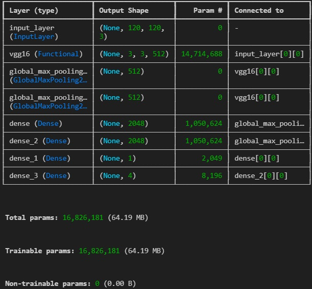
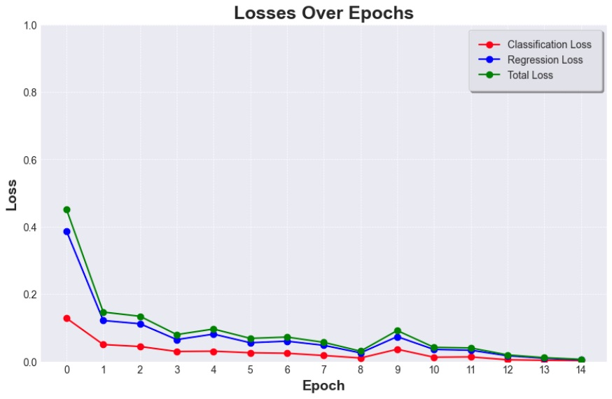
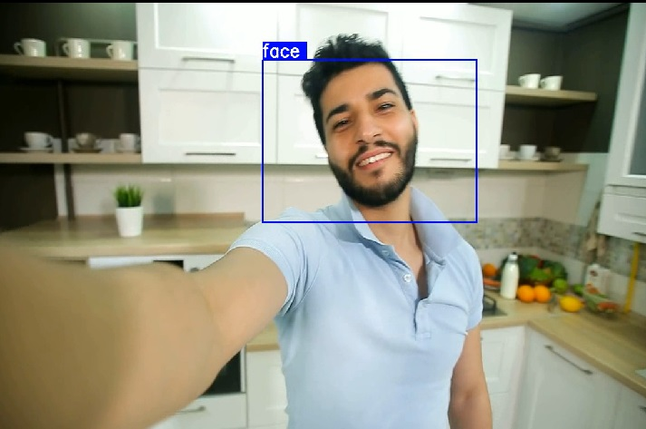

# webcamfacedetection
Deep learning project for live tracking the face using a webcam. It involves transfer learning techniques from the pre-trained VGG16 model. There is both classification and regression used. Classification is used for detecting face presence and regression is used for coordinates of the bounding box. This model was trained on very small range of data, but it can detect other faces with slightly worse performance too.

## Overview
Data is collected by a script that takes screenshot from a webcam every 0.5s, then it's augmented to create 60 times more images with different conditions.
- Model summary: 

    
- Loss

    

- Test on random stock video 

(https://mixkit.co/free-stock-video/influencer-waves-hello-to-subscribers-on-webcam-15909/)

    

## Guide (Windows 11)

First, clone this repository: 

### 1. Clone this repository
    git clone https://github.com/makspiotrowski02/webcamfacedetection.git
    cd webcamfacedetection

### 2. Create and activate virtual environment
    python -m venv *env_name*
    *env_name*\Scripts\activate 

### 3. Install libraries
    pip install uuid opencv-python tensorflow json numpy matplotlib albumentations keras

### 4. Create folders
#### data
inside of data:

- images
- labels 
- test
- train
- val

Inside of test, train and val: 
- images 
- labels

#### aug_data
- copy paste test, train and val folders (empty)

### 5. Run segment 'Only run once' only for data creation/augmentation
